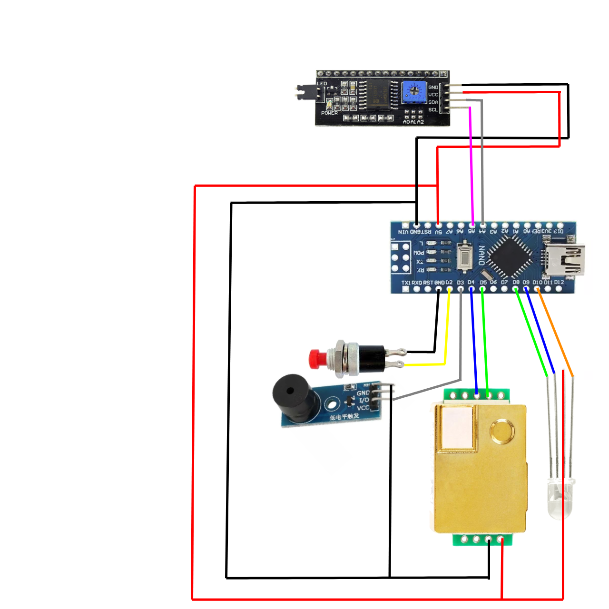

# Medidor de CO2 V3 - Arduino Nano
Esta es la tercer versión del medidor de CO2 con una placa Arduino Nano utilizando un display I2C, un sensor MH-Z19C, un led RGB y un buzzer.

### Pinout de la Arduino Nano

## Diagrama de conexiones

## Librerias utilizadas:
Sensor MH-Z19:  https://github.com/piot-jp-Team/mhz19_uart 

Display: https://github.com/fdebrabander/Arduino-LiquidCrystal-I2C-library 

En este repositorio se encuentran las librerias como archivos .zip para ser instaladas facilmente en el IDE de Arduino.

## Driver del microcontrolador
Hay dos versiones de placas 
La primer tanda utiliza el microcontrolador CH340G, el driver para su sistema operativo correspondiente se puede descargar desde este [enlace](http://www.wch.cn/download/CH341SER_EXE.html)
La segunda tanda utiliza el microcontrolador FT232R, el driver para su sistema operativo correspondiente se puede descargar de este [enlace](https://ftdichip.com/drivers/vcp-drivers/)

## Acerca del proyecto
La información del proyecto se puede encontrar en la [página web de Jorge Aliaga](http://www.jorgealiaga.com.ar/?page_id=2864)
